# 👋 Hi, I'm Heejoon Yi!  
### 🚀 Senior at Stony Brook University | TSM & CS Major  

I'm a passionate software engineer with business mindset.

---

## 🛠 Tech Stack  
### 💻 **Frontend**  
 
 
 

### 🔧 **Backend & Database**  
 
 
 
 

 

### ☁ **Cloud & DevOps**  
 

 
 
 

---

## ✨ Solo Projects  
> 🏗 **Featured Projects**  
### 🔹 [Infoscribe](https://github.com/lighteko/infoscribe)  
📌 **Tech Stack:** `Docker` `EC2` `Event Bridge` `Express.js` `Lambda` `MySQL` `Next.js` `Python` `RDS`  `S3` `SES` `SQS` `TypeScript`  
📖 **Description:** A user-tailored newsletter service, powered by LangChain.   
🔗 [Repo](https://github.com/lighteko/infoscribe)   

### 🔹 [Reppy(Ongoing)](https://github.com/lighteko/reppy)  
📌 **Tech Stack:** `Docker` `VM` `Queue` `Nest.js` `OCI Function` `PostgreSQL` `React Native` `Python` `Qdrant` `Supabase`  `Object Storage` `Streaming` `TypeScript`  
📖 **Description:** Workout logging application with AI trainer.  
🔗 [Repo](https://github.com/lighteko/reppy)   

## ✨ Team Projects  
> 🏗 **Featured Projects**

### 🔹 [Prism(Ongoing)](https://github.com/Prism-416/.github)  
📌 **Tech Stack:** `Docker` `VM` `Queue` `Nest.js` `OCI Function` `PostgreSQL` `Next.js` `Python` `pgvector` `Supabase`  `Object Storage` `Scheduler` `TypeScript`  
📖 **Description:** PM-Agent driven task management service  
🔗 [Repo](https://github.com/Prism-416/.github)   

---

## 📊 GitHub Stats    

  
  

---

## 🏆 Problem Solving    

    
    

🔗 [LeetCode Profile](https://leetcode.com/lighteko) 🔗 [Baekjoon Profile](https://www.acmicpc.net/user/lighteko)

---

📝 **Feel free to connect with me!** 😊  

